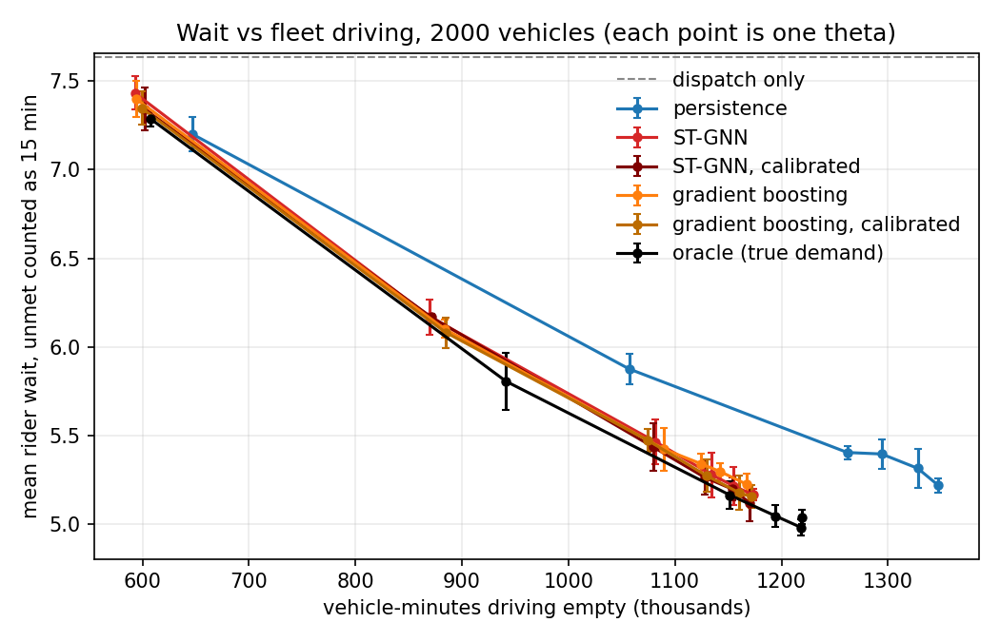

# SurgeMap

**NYC taxi demand forecasting and fleet repositioning with a spatio-temporal graph neural network**

SurgeMap forecasts how many taxi pickups each of New York's taxi zones will see over the next 5, 15, 30 and 60
minutes, then tests in a simulator whether using those forecasts to pre-position idle vehicles shortens rider
waits. It is part of the [FleetMg](https://github.com/shris-xyz/FleetMg) fleet management project.

The repository contains:

- **forecasters**: a directed-graph ST-GNN trained on four months of NYC yellow-taxi trips, compared with
  persistence, historical-average, ridge and gradient-boosted baselines fitted on the same data
- a **fleet simulator** that replays real pickups against a simulated fleet with nearest-vehicle dispatch
- a **repositioning policy**: a small min-cost-flow linear program driven by any forecast
- an **evaluation** of policies across fleet sizes, seeds and a cost trade-off sweep
- a **Streamlit app** to explore forecasts and run the simulator

---

## Data

- **Source**: [NYC TLC Yellow Taxi Trip Records](https://www.nyc.gov/site/tlc/about/tlc-trip-record-data.page)
  (official parquet files; January 2024 has 2,964,624 rows, of which 2,927,173 pass the validity filters)
- **Zones**: 258 taxi zones with at least one pickup; five of them have fewer than five trips in the month
- **Time grid**: 8,928 five-minute bins covering the whole month, none empty
- **Split**: chronological 70% train (to 22 Jan 16:45), 15% validation, 15% test (27 Jan 08:20 to 31 Jan 23:55)
- **Graph**: directed row-normalised flow matrices `A_out` and `A_in` from pickup-to-dropoff counts
- **Training history**: the shipped models are fitted on October 2023 to January 2024 (35,424 bins, same
  zones), with the same validation days and test window as above. That dataset is built by
  `preprocess.py` from the four monthly files and is not tracked; `real_processed_265` (January) is what
  the simulator and the app run on.

**Correction note.** Earlier versions of this project were built from a CSV that stopped at 29 Jan 21:38 and
held about 5% fewer trips than the official file, so the last two days of the test split were empty. Every
metric produced from that extract was inflated and has been discarded. The pipeline now reads the official
parquet file (`data/yellow_tripdata_2024-01.parquet`; `data/` is not tracked).

### Features per zone and time step

| Channel | Description |
|---------|-------------|
| `log_demand_zscore` | log(1 + pickups), standardised per zone on the training split, clipped to ±6 |
| `hour_sin`, `hour_cos` | cyclic time of day |
| `weekday_sin`, `weekday_cos` | cyclic day of week |
| `is_weekend` | weekend flag |
| `log_dropoff_zscore` | log(1 + dropoffs), standardised and clipped like demand |

---

## Model

1. **Spatial encoder**: `DirectedGraphConv` mixes neighbour features through `A_out` and `A_in` separately, plus
   a learned self-loop projection.
2. **Temporal encoder**: a one-layer GRU over a 48-bin (4 hour) window.
3. **Multi-horizon heads**: one linear head per horizon (1, 3, 6, 12 bins ahead) on the shared encoder.

Each output head also receives the demand of its own target time one day and one week earlier. Trained with AdamW
on shuffled windows, a Poisson loss on the pickup counts, gradient clipping and early stopping on the validation
loss. The shipped forecast is the average of five such networks trained with different seeds.

### Baselines

| Baseline | Description |
|----------|-------------|
| Persistence | the last observed bin |
| Historical average | mean training demand for the same zone, weekday and time of day |
| Ridge regression | one ridge model per zone on the flattened 48-bin window |
| Gradient boosting | one scikit-learn `HistGradientBoostingRegressor` per horizon across all zones, Poisson loss; lags, same time yesterday and last week, historical average, calendar, weather, citywide demand |

---

## Results

Held-out test window: 27 Jan 08:20 to 31 Jan 23:55 2024 (1,329 forecast times, 258 zones). No model was fitted
on it. Every fitted model below, the ST-GNN and the baselines alike, was trained on the same four months
(1 October 2023 to 22 January 2024). The shipped ST-GNN is the average of five networks (`model/`) trained with
different random seeds. How the recipe was arrived at is described under
[How the model got here](#how-the-model-got-here).

### Forecast accuracy

RMSE in pickups per zone per 5-minute bin (lower is better), from `artifacts/forecast_metrics.json`:

| Model | 5 min | 15 min | 30 min | 60 min |
|-------|-------|--------|--------|--------|
| **ST-GNN, calibrated** | **1.340** | **1.399** | **1.421** | **1.440** |
| ST-GNN | 1.342 | 1.408 | 1.433 | 1.456 |
| Gradient boosting, calibrated | 1.354 | 1.416 | 1.439 | 1.465 |
| Gradient boosting | 1.359 | 1.423 | 1.447 | 1.483 |
| Ridge regression | 1.428 | 1.534 | 1.625 | 1.769 |
| Historical average | 1.543 | 1.545 | 1.547 | 1.552 |
| Persistence | 1.716 | 1.889 | 2.016 | 2.189 |

"Calibrated" means two corrections fitted on the validation split only and applied identically to both models
(`scripts/calibrate_forecasts.py`): a per-zone, per-horizon bias correction, then a per-horizon blend with the
time-of-day average. Both models are trained on pickup counts with a Poisson loss and are nearly unbiased already,
so calibration adds little.

95% block-bootstrap intervals on RMSE(other) minus RMSE(ST-GNN), positive meaning the ST-GNN is better
(`scripts/accuracy_checks.py`):

| ST-GNN as trained vs | 5 min | 15 min | 30 min | 60 min |
|----------------------|-------|--------|--------|--------|
| Persistence | +0.374 [+0.335, +0.409] | +0.481 [+0.435, +0.525] | +0.583 [+0.532, +0.637] | +0.733 [+0.648, +0.827] |
| Historical average | +0.201 [+0.155, +0.252] | +0.137 [+0.106, +0.173] | +0.114 [+0.087, +0.144] | +0.097 [+0.073, +0.123] |
| Ridge regression | +0.086 [+0.058, +0.116] | +0.127 [+0.092, +0.162] | +0.193 [+0.143, +0.242] | +0.313 [+0.232, +0.403] |
| Gradient boosting | +0.016 [+0.009, +0.024] | +0.015 [+0.008, +0.022] | +0.014 [+0.005, +0.024] | +0.027 [+0.013, +0.041] |

- The ST-GNN is the most accurate model at every horizon, and every interval excludes zero.
- **Its lead over gradient boosting is small: 1 to 2%**, both as trained and after calibration (+0.014 [+0.006,
  +0.021], +0.017 [+0.011, +0.023], +0.018 [+0.012, +0.025], +0.024 [+0.016, +0.033]). On January alone that lead
  looked like 5 to 6%; gradient boosting gained far more from the extra months than the ST-GNN did (see below).
- It beats the historical average by 7 to 13%, ridge regression by 6 to 19%, and persistence by 22 to 34%.
- Pickups arrive at random, so even a perfectly known demand rate leaves an RMSE of about 1.16 here. The
  calibrated ST-GNN is 15% above that floor at 5 minutes and 24% at 60 (`scripts/headroom_analysis.py`).

Two cautions. The recipe was chosen over several rounds of experiments by looking at this same test window, so
the ST-GNN's margin is somewhat optimistic; the baselines were not tuned that way. Seed-to-seed variation for one
network is about 0.002 RMSE at 5 minutes and 0.003 at 60, smaller than the gap to gradient boosting but not by
much at short horizons.

Hotspot ranking, as the mean number of the 5 busiest zones also among the 5 predicted, across 5 to 60 minutes:
calibrated ST-GNN 3.31 to 3.20, calibrated gradient boosting 3.29 to 3.18, persistence 2.95 to 2.56. The top-3 hit
rate is 0.86 to 0.97 for every model, because the busiest zones barely change, so it does not separate them.

### Repositioning

Rider outcomes over the test window with `theta = 0.1`, by fleet size. Cells show unmet requests (%) and mean
rider wait (minutes, unmet requests counted as 15). Mean over 5 seeds; the standard deviation across seeds is
about 0.1 minute.

| Policy driven by | 1000 vehicles | 1500 | 2000 | 3000 |
|------------------|---------------|------|------|------|
| Dispatch only | 61.5 / 9.98 | 49.7 / 8.49 | 42.8 / 7.63 | 33.7 / 6.50 |
| Persistence | 57.0 / 9.25 | 40.2 / 7.07 | 27.3 / 5.40 | 12.6 / 3.41 |
| Ridge | 58.1 / 9.36 | 40.9 / 7.12 | 28.4 / 5.52 | 14.1 / 3.60 |
| Historical average | 57.5 / 9.30 | 39.7 / 6.96 | 26.5 / 5.23 | 12.2 / 3.24 |
| Gradient boosting | 57.2 / 9.27 | 39.9 / 6.99 | 27.0 / 5.31 | 12.6 / 3.32 |
| Gradient boosting, calibrated | 57.0 / 9.23 | 40.6 / 7.09 | 26.2 / 5.21 | 13.0 / 3.38 |
| ST-GNN | 57.3 / 9.27 | 40.3 / 7.05 | 27.0 / 5.31 | 12.8 / 3.37 |
| **ST-GNN, calibrated** | 57.3 / 9.28 | 40.0 / 7.01 | 26.3 / 5.22 | 12.3 / 3.30 |
| Oracle (true demand) | 56.8 / 9.17 | 40.3 / 6.98 | 25.7 / 5.05 | 12.2 / 3.18 |



- Forecast-driven repositioning clearly helps once the fleet is large enough: at 2,000 vehicles unmet requests fall
  from 42.8% to 26 to 29% and mean wait from 7.6 to about 5.2 to 5.5 minutes. At 1,000 vehicles there is little to
  gain.
- Comparing at equal driving cost along the `theta` sweep at 2,000 vehicles, the wait saved relative to a
  persistence-driven policy is 0.32 minutes for the calibrated ST-GNN (88% of what perfect demand knowledge would
  give), 0.31 for calibrated gradient boosting (87%), 0.29 for gradient boosting (81%) and 0.28 for the ST-GNN as
  trained (79%). Comparing at equal `theta` is misleading because policies drive different amounts.
- **A good forecast is enough; the best forecast adds nothing measurable.** The ST-GNN and gradient boosting are
  indistinguishable as policies, and a plain four-month time-of-day average does as well as either at
  `theta = 0.1` (5.23 and 3.24 minutes at 2,000 and 3,000 vehicles). The differences between these policies are
  within the seed-to-seed spread.
- Perfect foresight beats persistence by only 0.2 to 0.35 minutes of wait at 2,000 to 3,000 vehicles, which bounds
  how much any forecaster can add at a 15-minute decision horizon.

### How the model got here

The first ST-GNN (January only, batches of 128 in time order, squared error on log demand, kept as
`experiments/original_batch128_noshuffle.pt`) scored 1.449, 1.546, 1.618, 1.726 and was beaten by gradient boosting
at every horizon. `scripts/diagnose_stgnn.py` found why (`results/stgnn_diagnostics.json`):

- it under-predicted total pickups by 8.5 to 12%, from the log scale and the busier test days;
- it had no notion of which zone it was forecasting and saw only the last 4 hours;
- its loss weighted all 258 zones equally, while 86% of the squared error in pickups sits in the 30 busiest zones;
- it underfitted, and its training batches were consecutive, near-identical windows.

Each idea was then tested on a Kaggle T4 GPU, one change at a time (`experiments/`, and the
`results/*_experiments.json`, `round5_multi_month.json` and `round6_scores.json` files). Calibrated RMSE, one
network trained on January unless stated:

| Recipe (batch size 32) | 5 min | 15 min | 30 min | 60 min |
|------------------------|-------|--------|--------|--------|
| First model (batch 128, no shuffle) | 1.402 | 1.468 | 1.506 | 1.561 |
| No options | 1.422 | 1.487 | 1.533 | 1.580 |
| Shuffle | 1.385 | 1.446 | 1.484 | 1.526 |
| Shuffle + weather | 1.411 | 1.466 | 1.498 | 1.539 |
| Shuffle + zone embedding | 1.394 | 1.446 | 1.483 | 1.514 |
| Shuffle + time-of-day prior | 1.528 | 1.525 | 1.529 | 1.537 |
| Shuffle + weighted loss | 1.375 | 1.440 | 1.476 | 1.511 |
| ... average of five seeds | 1.369 | 1.432 | 1.465 | 1.494 |
| Shuffle + weighted loss, 128 hidden units | 1.369 | 1.437 | 1.477 | 1.513 |
| Shuffle + weighted loss, two GRU layers | 1.373 | 1.439 | 1.477 | 1.509 |
| Shuffle + weighted loss + lagged inputs | 1.371 | 1.436 | 1.470 | 1.496 |
| Shuffle + Poisson loss | 1.373 | 1.438 | 1.467 | 1.497 |
| Shuffle + Poisson loss + lagged inputs | 1.364 | 1.429 | 1.459 | 1.490 |
| ... average of five seeds | 1.356 | 1.422 | 1.451 | 1.480 |
| ... trained on two months | 1.360 | 1.420 | 1.445 | 1.468 |
| ... trained on four months, range over five seeds | 1.346 to 1.351 | 1.404 to 1.408 | 1.428 to 1.431 | 1.447 to 1.453 |
| **... four months, average of five seeds (shipped)** | **1.340** | **1.399** | **1.421** | **1.440** |

- Shuffling the training windows is the largest single gain from the training recipe.
- A loss aimed at pickup counts helps: first by weighting busy zones, then, better, as a Poisson likelihood, which
  also removes the volume bias.
- Giving the output heads the target time's demand a day and a week earlier helps a little alone and more with
  the Poisson loss. Forcing the same information in as a fixed offset (the time-of-day prior) made short horizons
  much worse.
- More capacity does not help: 128 hidden units and a second GRU layer both land inside the seed-to-seed spread.
  Neither do weather inputs or a zone embedding on top of the better loss.
- More training data helps steadily, most at long horizons. Averaging five seeds adds a further 0.4 to 0.6%.
- Nothing applied after the fact adds much: averaging the ST-GNN with gradient boosting, online bias correction, a
  last-error correction and Hedge weighting over five forecasters each gain 0.5% or less
  (`results/headroom_analysis.json`).

**More data helped the baselines more than the ST-GNN.** Calibrated or as-trained RMSE on the same test window:

| Model | Trained on | 5 min | 15 min | 30 min | 60 min |
|-------|------------|-------|--------|--------|--------|
| ST-GNN, calibrated, five seeds | January | 1.356 | 1.422 | 1.451 | 1.480 |
| | four months | 1.340 | 1.399 | 1.421 | 1.440 |
| Gradient boosting, calibrated | January | 1.422 | 1.506 | 1.539 | 1.577 |
| | four months | 1.354 | 1.416 | 1.439 | 1.465 |
| Historical average | January | 1.701 | 1.702 | 1.703 | 1.706 |
| | four months | 1.543 | 1.545 | 1.547 | 1.552 |

The ST-GNN improved by 1 to 3% and gradient boosting by 5 to 7%, so a 5 to 6% lead on January became a 1 to 2%
lead on four months. The January comparison flattered the network: with three weeks of history the baselines
lacked the weekly pattern that the network's recipe had been tuned to supply. (Fitting gradient boosting on four
months also needed an L2 term; without it the Poisson model predicted infinities for near-empty zones.)

**Does the graph help?** Less than the name suggests. In an early bundled retrain, removing the graph cost 2 to 4%
at every horizon. In a better-trained recipe (shuffle + zone embedding + weighted loss, January) the cost was 0.3 to
1.2% as trained, significant only at 15 minutes, and nothing measurable after calibration
(`results/model_selection.json`). Giving the gradient-boosted model flow-weighted neighbour demand left its error
unchanged (`results/spatial_check.json`). The ablation has not been repeated on the shipped recipe.

### What this means

On equal data, a carefully trained ST-GNN is the most accurate forecaster here, but only 1 to 2% ahead of a
gradient-boosted model with simple features. Its accuracy came from how it is trained (shuffling, a loss that matches count data, the right
extra inputs, more history, averaging seeds), not from its graph structure, whose measured contribution is about
1% or less, nor from making it bigger. For the repositioning policy the choice of forecaster does not matter once
it is unbiased and knows the daily pattern: a four-month time-of-day average performs as well as either model. The
case for the network is a small, consistent accuracy edge, not a decisive one.

---

## Repositioning study

**Simulator** (`scripts/simulator.py`). Real pickups of the test window are replayed against a fleet of idle
vehicles placed in proportion to demand. A request is served by an idle vehicle in its own zone with no wait, or
by the nearest idle vehicle within 15 minutes, whose drive time is the rider's wait. Otherwise it is lost. A
served trip returns its vehicle to a destination drawn from the observed flows after the observed mean trip
duration. Zone-to-zone driving times are shortest paths over the observed mean trip durations, since most zone
pairs have no direct trips.

**Policy** (`scripts/reposition.py`). Every 15 minutes a linear program decides how many idle vehicles to send
between zones, given the forecast demand over the next 15 minutes. It minimises
`theta × vehicle driving minutes + rider wait minutes + 15 × unserved requests`. Any forecast can drive it;
`theta` sets the trade-off between fleet driving and rider waiting.

**Evaluation** (`scripts/run_evaluation.py`). Policies driven by persistence, historical average, ridge,
gradient boosting, the ST-GNN (both as trained and calibrated) and the true demand ("oracle", an upper bound) are compared with dispatch alone, over several fleet sizes
and seeds, with a `theta` sweep to trace each policy's wait vs driving curve. Policies are also compared with
persistence at equal driving cost, so a policy that simply moves fewer vehicles is not mistaken for a worse one.

The fleet is synthetic, because public trip data has no vehicle positions. Read the study as a comparison between
policies, not as a prediction of real-world performance.

---

## Usage

```powershell
# Install (Python 3.11+; a virtual environment is recommended)
python -m pip install -r requirements.txt

# 1. Preprocess January 2024 into real_processed_265/ (the dataset the simulator and app use)
python scripts\preprocess.py --input data\yellow_tripdata_2024-01.parquet --out real_processed_265 --month 2024-01 --all-zones

# 2. Build the four-month training dataset (same zones, validation days and test window)
python scripts\preprocess.py --input data\yellow_tripdata_2023-10.parquet,data\yellow_tripdata_2023-11.parquet,data\yellow_tripdata_2023-12.parquet,data\yellow_tripdata_2024-01.parquet --out real_processed_4mo --start 2023-10-01 --end 2024-02-01 --zone-ids-from real_processed_265 --train-end "2024-01-22 16:45" --val-end "2024-01-27 08:20"

# 3. Train five seeds of the ST-GNN on it (about 45 minutes each on a GPU; impractical on a CPU)
python scripts\train_multihorizon_torch.py --data-dir real_processed_4mo --window 48 --epochs 70 --hidden 64 --batch-size 32 --lr 0.001 --patience 8 --shuffle --loss poisson --lag-features --seed 7 --out model\four_month_seed7.pt
python scripts\train_multihorizon_torch.py --data-dir real_processed_4mo --window 48 --epochs 70 --hidden 64 --batch-size 32 --lr 0.001 --patience 8 --shuffle --loss poisson --lag-features --seed 1 --out model\four_month_seed1.pt
python scripts\train_multihorizon_torch.py --data-dir real_processed_4mo --window 48 --epochs 70 --hidden 64 --batch-size 32 --lr 0.001 --patience 8 --shuffle --loss poisson --lag-features --seed 2 --out model\four_month_seed2.pt
python scripts\train_multihorizon_torch.py --data-dir real_processed_4mo --window 48 --epochs 70 --hidden 64 --batch-size 32 --lr 0.001 --patience 8 --shuffle --loss poisson --lag-features --seed 3 --out model\four_month_seed3.pt
python scripts\train_multihorizon_torch.py --data-dir real_processed_4mo --window 48 --epochs 70 --hidden 64 --batch-size 32 --lr 0.001 --patience 8 --shuffle --loss poisson --lag-features --seed 4 --out model\four_month_seed4.pt

# 4. Forecasts (the average of the networks in model/), baselines fitted on the same data, calibration
python scripts\export_predictions.py --data-dir real_processed_4mo --checkpoint model --out-dir artifacts_4mo
python scripts\accuracy_checks.py --data-dir real_processed_4mo --predictions artifacts_4mo\predictions.npz --merge
python scripts\calibrate_forecasts.py --data-dir real_processed_4mo --checkpoint model --predictions artifacts_4mo\predictions.npz

# 5. Re-index the forecasts onto the January dataset used by the simulator and the app
python scripts\align_predictions.py --predictions artifacts_4mo\predictions.npz --out artifacts\predictions.npz
copy artifacts_4mo\forecast_metrics.json artifacts\forecast_metrics.json

# 6. Run the repositioning study and draw the plots (a few minutes on 10 cores)
python scripts\run_evaluation.py --workers 10
python scripts\plot_results.py

# 7. Explore everything in the app
python -m streamlit run app\streamlit_app.py
```

The same steps are available as `make preprocess-265`, `make preprocess-4mo`, `make train`, `make export`, `make evaluate`,
`make plots`, `make app` and `make test`.

---

## Training options

`train_multihorizon_torch.py` options, all off by default. The shipped networks use
`--shuffle --loss poisson --lag-features` on the four-month dataset.

| Option | What it does |
|--------|--------------|
| `--shuffle` | shuffle training windows each epoch |
| `--loss-power P` | weight zones by `((1 + mean pickups) x sigma) ** P` in the loss; 2 approximates error in pickups |
| `--zone-dim N` | learned embedding per zone, fed to the output heads |
| `--weather` | append the precipitation and temperature channels |
| `--prior histavg_z` | predict the residual over the time-of-day average of each target bin |
| `--no-graph` | remove the neighbour terms (ablation) |
| `--layers N` | number of GRU layers |
| `--lag-features` | give each output head the target bin's demand one day and one week earlier |
| `--loss poisson` | train on the likelihood of the pickup counts instead of squared error in log units |

With a weighted loss the `train_rmse` and `val_rmse` printed during training are the weighted objective and are not
comparable across settings. `scripts/compare_checkpoints.py --calibrate` scores any checkpoints in pickups on the
test split, against the shipped models, with bootstrap intervals. Batch size 128 needs more than 15 GB of GPU
memory; 32 fits. Training takes minutes on a GPU and a few hours on a CPU.

### Training on more months

`preprocess.py` accepts several trip files and a date range, can reuse the zones of an existing dataset, and takes
explicit split times. This builds a longer training history while keeping the same zones, validation days and test
window, so `compare_checkpoints.py` can score the result against the shipped forecasts:

```powershell
python scripts\preprocess.py --input data\yellow_tripdata_2023-12.parquet,data\yellow_tripdata_2024-01.parquet --out real_processed_2mo --start 2023-12-01 --end 2024-02-01 --zone-ids-from real_processed_265 --train-end "2024-01-22 16:45" --val-end "2024-01-27 08:20"
```

---

## Project structure

```
SurgeMap/
├── app/                         Streamlit app (pages, helpers, trimmed zone polygons)
├── scripts/
│   ├── preprocess.py            Raw trips (CSV or parquet) -> tensors and graph
│   ├── train_multihorizon_torch.py   Multi-horizon ST-GNN trainer
│   ├── train_stgnn_torch.py     Single-horizon trainer; defines the graph convolution
│   ├── multihorizon_baseline.py Persistence and ridge baselines (z-score space)
│   ├── hotspot_eval.py          Top-k hotspot evaluation of a checkpoint
│   ├── export_predictions.py    Count-space forecasts for the simulator and app
│   ├── accuracy_checks.py       Extra baselines, bootstrap intervals, merge into the forecasts
│   ├── calibrate_forecasts.py   Validation-fitted bias correction and blend for both models
│   ├── diagnose_stgnn.py        Where the ST-GNN's error comes from
│   ├── compare_checkpoints.py   Scores checkpoints against the shipped models, optionally calibrated
│   ├── simulator.py             Fleet simulator with dispatch matching
│   ├── reposition.py            Forecast-driven LP repositioning policy
│   ├── run_evaluation.py        Policy comparison and trade-off sweep
│   ├── plot_results.py          Plots of the study
│   ├── prepare_zones.py         Trims the NYC taxi zone polygons for the app
│   ├── build_dropoff.py, build_weather.py, stgnn_models.py   Auxiliary tools
├── model/                       The five shipped checkpoints (trained on four months); forecasts are averaged
├── experiments/                 Checkpoints from the training experiments, including earlier models
├── tests/                       pytest suite
├── real_processed_265/          Preprocessed arrays (demand, features, graph, metadata)
├── notebooks/                   Feature experiments
└── config.yaml                  Reference settings (not read at runtime)
```

---

## Limitations

- Four months of training data and one five-day test window, so seasonality is barely covered and the test
  window is short.
- The flow graph is built from the whole month, including the test period; this is a mild form of leakage.
- Observed pickups are what taxis actually served, which understates true demand where supply was short.
- The repositioning study uses a synthetic fleet, a simple dispatch rule and lost (not queued) requests.
- Only yellow taxis are included.

## Acknowledgements

- NYC Taxi & Limousine Commission for the trip record data
- NYC Open Data for the taxi zone boundaries
